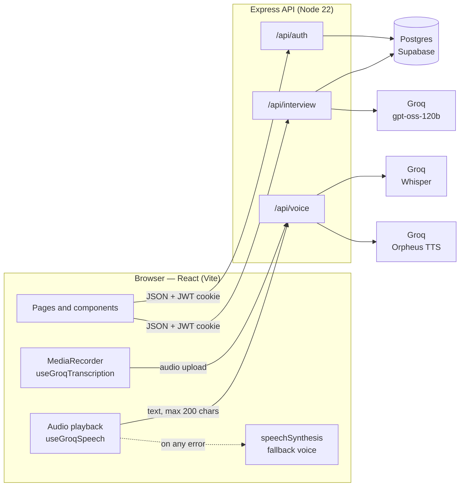
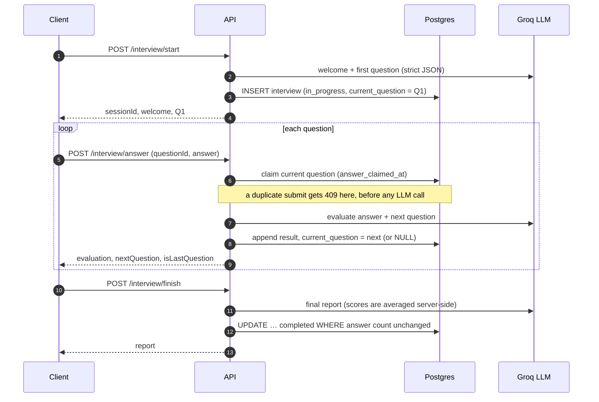

# Architecture
{: .no_toc }

1. TOC
{:toc}

## Overview



In production, Express also serves the built client from `client/dist`, so the whole app is a single service on a single origin.

## Repository layout

```
client/                 React app
  src/api/              axios clients: auth, interview, voice
  src/hooks/            useGroqTranscription, useGroqSpeech, useSpeechSynthesis, useAntiCheat
  src/pages/            Landing, Login, Register, Setup, Interview, Result, Dashboard
  src/utils/splitText.js  sentence chunking for both voices
server/
  index.js              app setup, routes, static hosting
  config/               env loading (always reads server/.env)
  db/schema.sql         idempotent schema, applied at startup
  db/*.crt              Supabase root CA for verified TLS
  models/               plain-SQL data access: user.js, interview.js
  controllers/          auth, interview, voice
  services/             groqClient, groqAiService (prompts + schemas), mockAiService, aiService (router)
  scripts/smoke-test.js end-to-end API test (CI)
docs/                   this site (GitHub Pages)
```

## Interview lifecycle

An interview is **one row** in `interviews`. It starts as `in_progress`, which is the live session, and becomes `completed` once the report is written. Every query is scoped to the logged-in user, so one user can never read or modify another user's interview.



Correctness guarantees:

- **The server is the source of truth for questions.** Answers are evaluated against `current_question` as stored in the database. The question text the client sends is ignored.
- **No double evaluation.** The question is claimed before the LLM call. A second submit gets `409`, and a claim older than 2 minutes counts as abandoned.
- **Consistent reports.** Completing an interview is conditional on the number of answers the report was built from. If an answer arrives mid-report, the report is regenerated.
- **Restart-safe.** Nothing lives in memory, so a redeploy in the middle of an interview loses nothing.

## Voice pipeline

### Speech to text: your answers

`useGroqTranscription` records the microphone with `MediaRecorder`: webm/opus in Chrome and Firefox, mp4 in Safari. When you stop recording, it uploads the clip to `POST /api/voice/transcribe`, which forwards it to Groq `whisper-large-v3-turbo`. The transcript comes back for you to review before you submit.

- The upload must be exactly one file of at most 25 MB, with no other form fields.
- A stop click while the browser is still asking for mic permission cancels the start.
- Resetting or leaving the page aborts an in-flight upload.
- If mic access is denied or unsupported, the UI switches to a text box.

### Text to speech: the interviewer

`useGroqSpeech` splits text into sentence chunks of at most 190 characters (Orpheus allows 200 per request) and plays them in order. It fetches chunk *n+1* while chunk *n* plays. The server returns WAV with corrected header sizes, because Groq streams placeholder sizes.

**Fallback:** the first failure (`429` rate limit, `503` terms not accepted, `501` disabled, a network error, or a playback error) hands the rest of the text to the browser's `speechSynthesis`. After a `429` the Groq voice is retried 2 minutes later; after any other failure it stays off for the session. The browser voice has a 1-second timeout for loading voices, so it can't stall the interview on systems with no voices installed.

Muting mid-sentence completes the pending step, so the interview moves on rather than waiting for speech that will never finish.

## Data model

### `users`

| Column | Type | Notes |
|--------|------|-------|
| `id` | uuid PK | exposed to the client as `_id` |
| `full_name` | text | |
| `email` | text unique | stored lowercased |
| `password_hash` | text null | bcrypt, 10 rounds; null for Google-only accounts |
| `google_id` | text unique null | |
| `created_at`, `updated_at` | timestamptz | |

A check constraint requires a password hash or a Google ID.

### `interviews`

| Column | Type | Notes |
|--------|------|-------|
| `id` | uuid PK | the `sessionId`, and `_id` in history |
| `user_id` | uuid FK → users | `ON DELETE CASCADE` |
| `status` | text | `in_progress` or `completed` |
| `candidate_name`, `role`, `experience`, `difficulty` | text | from setup |
| `total_questions` | int | |
| `current_question` | jsonb | `{ id, text }` awaiting an answer; `NULL` when done |
| `answer_claimed_at` | timestamptz | set while an answer is being evaluated |
| `question_results` | jsonb array | per-answer scores, strengths, weaknesses, feedback |
| `overall_score`, `technical_accuracy`, `communication_score` | int | averages, set on completion |
| `strengths`, `weaknesses`, `suggested_topics` | jsonb | from the final report |
| `feedback` | text | final assessment |
| `created_at`, `completed_at` | timestamptz | `completed_at` is shown as the history `date` |

Both tables have **Row Level Security enabled with no policies**. On Supabase that blocks the `anon` and `authenticated` roles completely, while the server (the table owner) bypasses RLS.

## Security notes

- **Sessions:** JWT in an `httpOnly`, `SameSite=Strict` cookie, `Secure` in production.
- **Passwords:** bcrypt. Login errors never reveal whether an email exists.
- **Google sign-in:**
  - The ID token is verified against `GOOGLE_CLIENT_ID`, and the endpoint is disabled when that isn't set.
  - Only Google-verified emails are accepted.
  - Linking to an existing account drops its unverified password.
  - A second Google account on the same email gets `409`.
- **Database:** TLS is verified (Supabase CA bundled), and all queries are parameterised.
- **AI prompt output:** strict JSON schemas, validated again on the server before use.

## Known limitations

- The **resume upload** on the setup page is UI only. The file isn't sent to the server or used in questions yet.
- **Anti-cheat** runs on the client (fullscreen, tab/focus/back detection). It deters casual switching but can't be enforced server-side.
- The **Groq free-tier** voice covers about one interview a day. The browser voice takes over after that.
