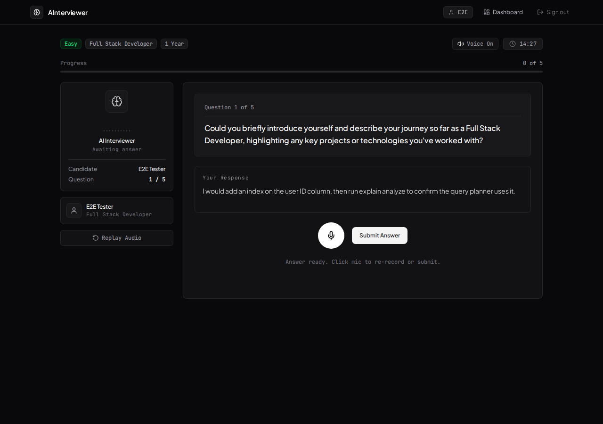
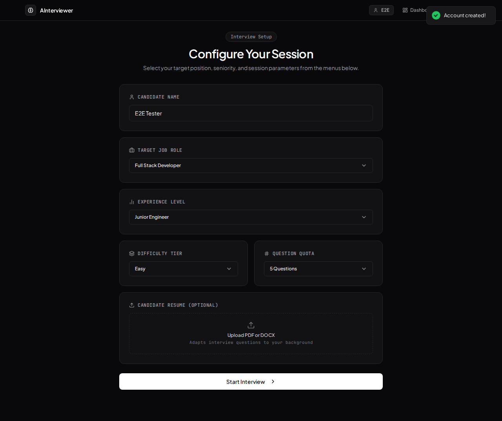
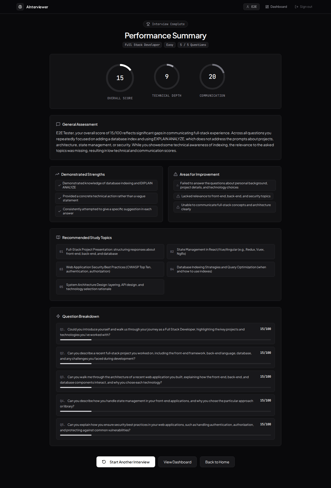
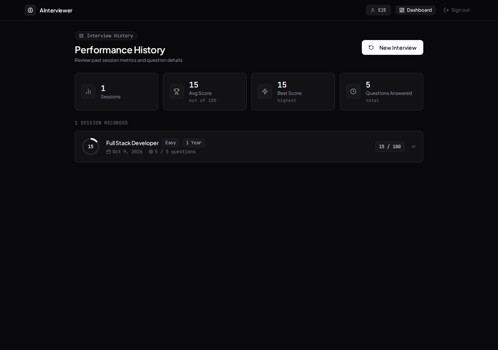

# AI Interviewer

Practice technical interviews out loud. An AI interviewer asks role-specific questions in a natural voice, listens to your spoken answers, scores each one, and writes a final report with strengths, gaps and topics to study.
{: .fs-6 .fw-300 }

[Get started](getting-started){: .btn .btn-primary .fs-5 .mb-4 .mb-md-0 .mr-2 }
[View on GitHub](https://github.com/harshithsunku/ai-interviewer){: .btn .fs-5 .mb-4 .mb-md-0 }

---

## Features

- **Voice in, voice out.** Questions are spoken with Groq's Orpheus voice. Answers are recorded in the browser and transcribed by Groq Whisper, so it works in any modern browser and not only Chrome.
- **Never goes silent.** If Groq text-to-speech is unavailable (free-tier quota, rate limit, outage), the app switches to the browser's built-in voice automatically.
- **Adaptive questions.** `openai/gpt-oss-120b` on Groq writes each next question based on the role, the difficulty and what was already asked, with strict JSON outputs.
- **Per-answer scoring.** Every answer gets overall, technical-accuracy and communication scores, plus strengths, weaknesses and feedback.
- **Final report and history.** Each interview ends with a holistic assessment and study topics. Completed interviews are saved to your dashboard.
- **Accounts.** Email and password sign-in, with optional Google sign-in. JWTs are kept in httpOnly cookies.
- **Interview integrity.** Fullscreen mode plus tab-switch and focus-loss detection, with automatic disqualification after 3 violations.
- **Resilient sessions.** Live interviews are stored in Postgres, so a server restart or redeploy doesn't lose progress.

## Screenshots

| Setup | Report | Dashboard |
|:--:|:--:|:--:|
|  |  |  |

## Tech stack

| Layer | Technology |
|-------|------------|
| Client | React 19, Vite 8, Tailwind CSS 4, Framer Motion |
| Server | Node.js 20, Express 5, `pg`, `groq-sdk`, `multer` |
| Database | PostgreSQL (Supabase in production; any Postgres 13+ works) |
| AI | Groq: `openai/gpt-oss-120b`, `whisper-large-v3-turbo`, `canopylabs/orpheus-v1-english` |
| Hosting | One Render web service that serves the API and the built client |

## Documentation

| Page | What's in it |
|------|--------------|
| [Getting started](getting-started) | Run it locally in a few minutes |
| [Configuration](configuration) | Every environment variable |
| [Deployment](deployment) | Supabase, Groq and Render setup |
| [Architecture](architecture) | How the pieces fit: voice pipeline, interview state machine, data model |
| [API reference](api) | REST endpoints, payloads and error codes |
| [Troubleshooting](troubleshooting) | Common problems and fixes |
